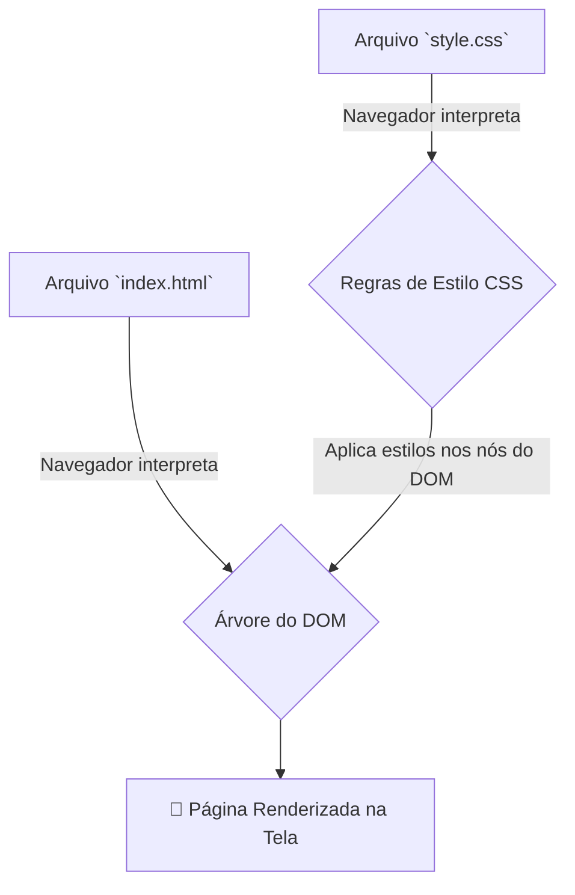

# 🎨 HTML & CSS: Estrutura e Estilo da Web

HTML e CSS são as duas linguagens fundamentais que formam a base de praticamente todas as páginas na World Wide Web. Embora trabalhem em conjunto, elas têm responsabilidades completamente distintas, seguindo um princípio crucial de desenvolvimento web: a **separação de responsabilidades**.

### A Dupla Fundamental: Esqueleto e Roupa

Pense na construção de uma página web como a montagem de um corpo humano:

  - **HTML (HyperText Markup Language)**: É o **esqueleto**. Ele define a **estrutura** e o **significado semântico** do conteúdo. O HTML diz ao navegador: "Isto é um título", "Isto é um parágrafo", "Isto é uma imagem", "Isto é uma lista de itens".
  - **CSS (Cascading Style Sheets)**: São as **roupas, a pele e o cabelo**. Ele define a **apresentação visual** e o **estilo** dos elementos HTML. O CSS diz ao navegador: "Faça o título ser azul e com uma fonte grande", "Coloque uma margem ao redor do parágrafo", "Posicione a imagem à direita".

Separar a estrutura do estilo torna o código mais limpo, mais fácil de manter, mais acessível e mais flexível.

-----

## 🦴 HTML: A Estrutura e o Significado do Conteúdo

HTML não é uma linguagem de programação; é uma **linguagem de marcação**. Ela usa "tags" para marcar e descrever as diferentes partes de um documento.

### A Anatomia de um Elemento HTML

Um elemento HTML geralmente consiste em uma tag de abertura, o conteúdo e uma tag de fechamento.

```html
<p class="paragrafo-destaque">Este é o conteúdo do parágrafo.</p>
```

  - **Tags**: `<p>` (abertura) e `</p>` (fechamento) definem que este é um elemento de parágrafo.
  - **Conteúdo**: O texto que fica entre as tags.
  - **Atributos**: `class="paragrafo-destaque"` é um atributo que fornece informações extras sobre o elemento (neste caso, um nome de classe para estilização com CSS).

### Estrutura Básica de um Documento

Todo arquivo HTML segue esta estrutura fundamental:

```html
<!DOCTYPE html> <html lang="pt-br">
<head>
    <meta charset="UTF-8">
    <meta name="viewport" content="width=device-width, initial-scale=1.0">
    <title>Título da Minha Página</title>
    <link rel="stylesheet" href="style.css"> </head>
<body>
    <header>
        <h1>Meu Site Incrível</h1>
    </header>
    <main>
        <p>Bem-vindo ao meu site!</p>
    </main>
</body>
</html>
```

### Tags Semânticas

O HTML5 introduziu tags semânticas que dão um significado mais claro à estrutura do conteúdo, o que é vital para **acessibilidade** (leitores de tela) e **SEO** (mecanismos de busca). Em vez de usar `<div>` para tudo, usamos tags como:

  - `<header>`: Para o cabeçalho do site ou de uma seção.
  - `<nav>`: Para o menu de navegação principal.
  - `<main>`: Para o conteúdo principal e único da página.
  - `<article>`: Para um bloco de conteúdo independente, como um post de blog.
  - `<section>`: Para agrupar conteúdos relacionados.
  - `<footer>`: Para o rodapé.

-----

## 🎨 CSS: Dando Vida e Estilo à Estrutura

CSS é uma linguagem de regras de estilo. Cada regra seleciona um ou mais elementos HTML e aplica um conjunto de propriedades de estilo a eles.

### A Anatomia de uma Regra CSS

```css
/* Seletor      Propriedade   Valor */
h1 {
  color: #3366cc;
  font-size: 24px;
}
```

  - **Seletor (`h1`)**: Aponta para qual(is) elemento(s) HTML a regra deve ser aplicada. Pode ser um tipo de tag (`p`), uma classe (`.minha-classe`) ou um ID (`#meu-id`).
  - **Bloco de Declaração (`{...}`)**: Contém uma ou mais declarações de estilo.
  - **Declaração (`color: #3366cc;`)**: Um par de `propriedade: valor` que define um estilo específico.

### Formas de Aplicar CSS

1.  **Arquivo Externo (Melhor Prática)**: As regras são escritas em um arquivo `.css` separado e vinculadas ao HTML através da tag `<link>`, como no exemplo de estrutura acima.
2.  **Interno**: As regras são colocadas dentro de uma tag `<style>` no `<head>` do arquivo HTML.
3.  **Inline**: O estilo é aplicado diretamente em um elemento HTML através do atributo `style`. Ex: `<p style="color: red;">`. (Deve ser evitado na maioria dos casos).

### O "C" de Cascading (Cascata)

A "Cascata" é o algoritmo que o navegador usa para resolver conflitos quando múltiplas regras CSS se aplicam ao mesmo elemento. A decisão é baseada em três fatores:

1.  **Especificidade**: Regras mais específicas (como um `#id`) têm mais peso do que regras genéricas (como uma `tag`).
2.  **Importância**: O uso de `!important` (a ser evitado) pode sobrescrever outras regras.
3.  **Ordem da Fonte**: Se a especificidade for a mesma, a última regra declarada no código vence.

-----

## 🔗 Como HTML e CSS se Conectam: O DOM

O elo de ligação entre o HTML e o CSS é o **DOM (Document Object Model)**.

1.  Quando um navegador carrega um arquivo `.html`, ele o interpreta e cria uma representação em memória em formato de árvore: o DOM.
2.  Em seguida, o navegador carrega o arquivo `.css`.
3.  O motor de renderização do navegador percorre a árvore do DOM e, para cada elemento (nó), ele verifica as regras CSS para ver quais estilos se aplicam.
4.  Finalmente, a página é "pintada" na tela, com a estrutura do HTML e os estilos do CSS aplicados.

<!-- end list -->



-----

## ✨ Conceitos Modernos de CSS

O CSS evoluiu muito para permitir a criação de layouts complexos e adaptáveis.

  - **Design Responsivo**: Usando **Media Queries** (`@media`), é possível aplicar estilos diferentes com base nas características do dispositivo, como a largura da tela. Isso permite que um site tenha uma boa aparência em desktops, tablets e celulares.
  - **Flexbox**: Um modelo de layout unidimensional projetado para alinhar e distribuir espaço entre itens em um contêiner, seja em linha ou em coluna.
  - **Grid Layout**: Um poderoso modelo de layout bidimensional que permite criar layouts complexos baseados em grades, controlando tanto linhas quanto colunas.

-----

## 🚀 Começando com HTML & CSS

A beleza de começar com HTML e CSS é que você só precisa de duas coisas:

1.  Um **editor de texto simples** (como VS Code, Sublime Text ou até o Bloco de Notas).
2.  Um **navegador web** (como Chrome, Firefox, etc.).

**Fluxo de trabalho básico:**

1.  Crie uma pasta para o seu projeto.
2.  Dentro dela, crie um arquivo chamado `index.html`.
3.  Crie outro arquivo chamado `style.css`.
4.  No `index.html`, adicione a estrutura básica e a tag `<link rel="stylesheet" href="style.css">` dentro do `<head>`.
5.  Escreva seu HTML no `<body>` e seus estilos no `style.css`.
6.  Abra o arquivo `index.html` no seu navegador para ver o resultado\!